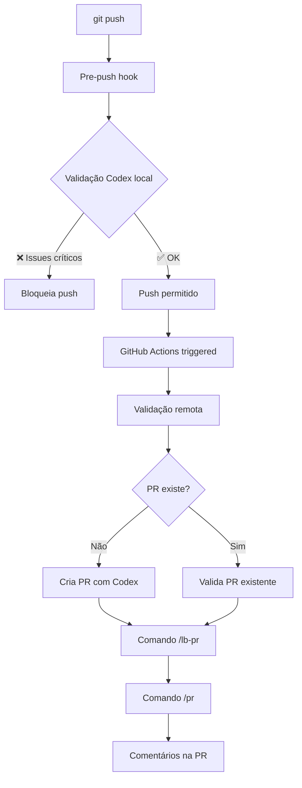

# 🤖 OpenAI Codex Pipeline

Este pipeline automatiza a validação de código e gerenciamento de PRs usando OpenAI Codex, conforme solicitado.

## 🎯 Funcionalidades

### ✅ Implementado

1. **Pipeline Local** - Executa a cada push (antes de subir para remoto)
   - Hook `pre-push` que roda validação Codex local
   - Verifica secrets, arquivos grandes, e problemas críticos
   - Bloqueia push se encontrar issues críticos

2. **GitHub Actions** - Executa após push no repositório remoto
   - Validação automática com Codex
   - Criação automática de PRs usando `gh` CLI
   - Validação de PRs com comando simulado `/lb-pr`
   - Review automático com comando simulado `/pr`

3. **Gerenciamento Automático de PRs**
   - Verifica se PR já existe para a branch
   - Cria PR automaticamente se não existir
   - Usa Codex para gerar título e descrição inteligentes
   - Aplica validações e comentários automáticos

4. **Review Automático com Codex**
   - Análise completa do código (segurança, performance, qualidade)
   - Comentários detalhados nas PRs
   - Simulação dos comandos `/lb-pr` e `/pr`
   - Scores e recomendações de aprovação

## 🚀 Como Usar

### 1. Configuração Inicial
```bash
# Execute o script de setup
python setup_codex_pipeline.py
```

### 2. Configure sua chave da OpenAI
```bash
# Crie arquivo .env (copie do .env.example)
cp .env.example .env

# Adicione sua chave da OpenAI
echo "OPENAI_API_KEY=sua_chave_aqui" >> .env
```

### 3. Configure secrets do GitHub (para o dono do repo)
- Vá em Settings → Secrets and variables → Actions
- Adicione: `OPENAI_API_KEY` com sua chave da OpenAI
- O `GITHUB_TOKEN` é fornecido automaticamente

### 4. Teste o pipeline
```bash
# Faça algumas mudanças
echo "print('hello codex')" >> test.py
git add test.py
git commit -m "test: pipeline codex"

# O hook pre-push vai rodar automaticamente
git push

# Se estiver em uma branch != main, uma PR será criada automaticamente
```

## 📁 Estrutura dos Arquivos

```
.github/
├── workflows/
│   └── codex-pipeline.yml          # GitHub Actions workflow
└── scripts/
    ├── codex_validator.py          # Validação de código com Codex
    ├── pr_manager.py               # Gerenciamento automático de PRs
    ├── pr_reviewer.py              # Review automático de PRs
    └── pre_push_hook.py            # Hook pre-push local

.git/hooks/
└── pre-push                        # Hook instalado automaticamente

setup_codex_pipeline.py             # Script de configuração
CODEX_PIPELINE.md                   # Esta documentação
```

## 🔧 Como Funciona

### Pipeline Local (Pre-Push)
1. **Trigger**: Quando você executa `git push`
2. **Execução**: Hook `pre-push` roda `pre_push_hook.py`
3. **Validação**: 
   - Analisa mudanças com Codex
   - Verifica secrets hardcoded
   - Checa arquivos grandes
   - Valida sintaxe básica
4. **Resultado**: Bloqueia push se houver issues críticos

### Pipeline Remoto (GitHub Actions)
1. **Trigger**: Push para qualquer branch
2. **Jobs**:
   - `codex-validation`: Valida código com Codex
   - `auto-pr-management`: Cria PR se não existir
   - `pr-review-automation`: Review automático de PRs

### Comando `/lb-pr` (Simulado)
- Validação técnica da PR
- Verifica cobertura de testes
- Analisa documentação
- Atualiza descrição da PR com resultados

### Comando `/pr` (Simulado)  
- Review completo do código
- Análise de arquitetura, segurança, performance
- Comentários detalhados na PR
- Scores e recomendações

## 🎛️ Personalização

### Modelos OpenAI
Edite os scripts para usar diferentes modelos:
```python
# Nos arquivos .github/scripts/*.py
model="gpt-4"  # ou "gpt-3.5-turbo", "codex-davinci-002"
```

### Configuração de Validação
No `pre_push_hook.py`, ajuste:
```python
# Limite de tamanho de arquivo
if file_size > 10 * 1024 * 1024:  # 10MB

# Padrões de secrets
secret_patterns = [
    (r'api[_-]?key["\']?\s*[:=]\s*["\'][^"\']{20,}', 'API key'),
    # Adicione seus padrões...
]
```

### GitHub Actions
No `.github/workflows/codex-pipeline.yml`:
```yaml
# Altere branches monitoradas
on:
  push:
    branches: [ main, develop, staging ]  # adicione suas branches
```

## 🐛 Troubleshooting

### Hook não executa
```bash
# Verifique se o hook existe e é executável
ls -la .git/hooks/pre-push
chmod +x .git/hooks/pre-push
```

### Erro de API key
```bash
# Verifique se a chave está configurada
echo $OPENAI_API_KEY
# ou
cat .env | grep OPENAI_API_KEY
```

### GitHub CLI não autenticado
```bash
gh auth login
```

### Bypass do hook (emergência)
```bash
git push --no-verify
```

## 📊 Logs e Debugging

### Logs locais
```bash
# Execute validação manual
python .github/scripts/pre_push_hook.py

# Execute review manual de PR
PR_NUMBER=123 python .github/scripts/pr_reviewer.py
```

### Logs do GitHub Actions
- Vá em Actions no seu repositório GitHub
- Clique no workflow "OpenAI Codex Pipeline"
- Veja logs detalhados de cada job

### Artifacts
- Relatórios são salvos em `artifacts/codex-validation-report.md`
- Screenshots e logs ficam disponíveis nas Actions

## 💡 Dicas

1. **Performance**: O pipeline usa cache e otimizações para ser rápido
2. **Segurança**: Nunca commite API keys - use secrets do GitHub
3. **Customização**: Todos os prompts podem ser personalizados
4. **Bypass**: Use `--no-verify` em emergências
5. **Logs**: Sempre verifique os logs para debugging

## 🔄 Fluxo Completo



---

**🎉 Pipeline configurado com sucesso!** 
Para suporte, verifique os logs do GitHub Actions ou execute os scripts manualmente para debugging.